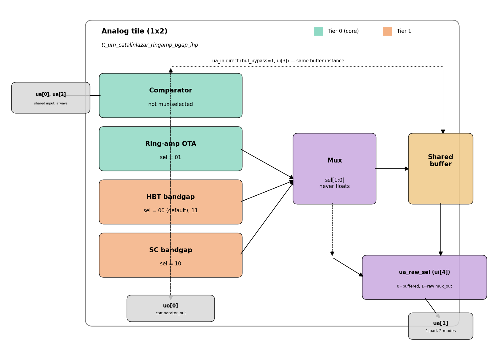

<!--
PROJECT_NAME token: tt_um_catalinlazar_ringamp_bgap_ihp
(keep identical to info.yaml top_module / repo name / GDS filenames)
-->

## How it works

This project (`tt_um_catalinlazar_ringamp_bgap_ihp`) is a small library of four
SG13G2 analog primitives sharing one 1x2 analog tile:

1. **Block 0 — Dynamic latched comparator** (StrongARM / double-tail latch)
2. **Block 1 — Ring-amplifier (FEA-style) OTA**
3. **Block 2 — SiGe HBT bandgap reference** (Brokaw/Banba-style)
4. **Block 3 — Switched-capacitor bandgap** ("end-of-life" variant, built from
   Blocks 0 and 1)

Only one block is connected to the shared analog bus (`ua[0..2]`) at a time.
A digitally controlled analog mux (CMOS transmission gates) selects the
active block via `mux_sel[1:0]` on `ui[1:0]`. This keeps the analog pin
count down to 3 regardless of how many blocks are on the tile.

**Block-select mapping** (deliberately no floating/idle state — the bus
always has a real, defined block connected):

| sel[1:0] | Block |
|---|---|
| 00 (default at reset) | HBT bandgap |
| 01 | Ring-amp OTA |
| 10 | SC bandgap |
| 11 | HBT bandgap (redundant safe code) |

The default (00) is deliberately the HBT bandgap, not the ring-amp: it's
a simple resistor-set DC output that stays well-behaved under an
unknown/undefined external load, whereas the ring-amp's settling is
tuned around a specific expected capacitance and the SC bandgap's
charge-domain operation is actively corrupted by unexpected external
capacitance. Putting either of those on the bus by default, before you've
deliberately set the select bits, risked exactly the kind of ambiguous
"is it broken or is it my test setup" failure mode this mapping avoids.

The mux output always passes through a single **shared output buffer**
before reaching `ua[1]` — isolating the ring-amp/bandgap output nodes from
unpredictable off-chip loading (pad + ESD + cable + scope capacitance can
easily be 10-20x the on-chip load these circuits are tuned for, which
matters especially for the ring-amp's settling behavior). `buf_bypass`
(`ui[3]`) forces this *same* buffer instance's input to connect directly to
`ua_in`, for buffer-only characterization — deliberately the same instance,
not a duplicate copy, so its measured non-idealities can be de-embedded
from the block measurements without adding new instance-to-instance
mismatch. Buffer topology TBD (source follower is the leading candidate).

`ua_raw_sel` (`ui[4]`) is a **mode select on the same `ua[1]` pad**, not a
second physical pin: 0 = buffer output (normal), 1 = bare mux output,
bypassing the buffer entirely — useful if the buffer itself is ever in
doubt. A dedicated second pin for this was considered and rejected: it
would permanently load the sensitive mux_out node with pad/ESD
parasitics (worst case for the ring-amp) even when never used. The
trade-off is that raw and buffered outputs can only be viewed
sequentially, not simultaneously on two scope channels.

All four blocks target a **~1.0V supply**. This is straightforward for
Blocks 0-1 (dynamic/inverter-chain structures with no static headroom
fight) but is the interesting constraint for Block 2: a naive BJT bandgap
generates VBE + K*ΔVBE in series, landing near the physical silicon
bandgap voltage (~1.2V) which doesn't shrink with process scaling, so it
would need ~1.3-1.5V of headroom. Block 2 instead sums PTAT/CTAT as
*currents* into a single output resistor (Malcovati-style), so the output
level is a resistor ratio rather than a forced series stack, keeping every
internal node within 1.0V-friendly headroom. Block 3 inherits the same
benefit naturally, since its output level is set by capacitor ratio.

To our knowledge this is the first HBT-based bandgap reference on any
open-PDK Tiny Tapeout shuttle; existing TT bandgap projects (e.g. TT07/TT08)
are Sky130-based and CMOS-only, since Sky130 lacks dedicated BJTs.

_(Fill in the circuit-level description, topology diagram, and equations
for each block here as the design matures — this is the "big blocks and
pin connections" writeup planned as the next step.)_

## How to test

_(To be completed once testbenches exist. Outline per block:)_
- Block 0 (comparator): apply differential signal to `ua[0]`/`ua[2]`, clock
  on `ui[2]`, read digital result on `uo[0]`. Not affected by `sel[1:0]`.
- Block 1 (ring-amp OTA): set `sel[1:0]=01`, apply input on `ua[0]`, read
  amplified output on `ua[1]` (buffered by default).
- Block 2 (HBT bandgap): `sel[1:0]=00` (also the power-on default) or `11`,
  read DC reference voltage on `ua[1]`, no input needed.
- Block 3 (SC bandgap): set `sel[1:0]=10`, read DC reference voltage on
  `ua[1]`, requires `ui[2]` clock for the switching phases.
- Buffer characterization: `buf_bypass=1` routes `ua_in` straight into the
  buffer (any `sel[1:0]`), read `ua[1]`.
- Raw/unbuffered debug mode: `ua_raw_sel=1` makes `ua[1]` show the bare
  mux output instead of the buffer output, for the currently selected
  block. Switch back to `ua_raw_sel=0` to compare — not simultaneous.

## External hardware

None required beyond the Tiny Tapeout demo/breakout board and a bench
supply/scope or DMM for the analog pins (or the TT analog measurement
add-on, if used).
